Table of Contents
=================

* [一.架构](#一架构)
   * [1.操作模式与状态](#1操作模式与状态)
   * [2.通用寄存器](#2通用寄存器)
   * [3.特殊寄存器](#3特殊寄存器)
      * [3.1 程序状态寄存器](#31-程序状态寄存器)
         * [3.1.1 应用PSR(APSR)](#311-应用psrapsr)
      * [3.2 PRIMASK,FAULTMASK和BASEPRI寄存器](#32-primaskfaultmask和basepri寄存器)
      * [3.3 CONTROL寄存器](#33-control寄存器)
      * [3.4 浮点寄存器](#34-浮点寄存器)

<!-- Created by https://github.com/ekalinin/github-markdown-toc -->


# 一.架构

## 1.操作模式与状态

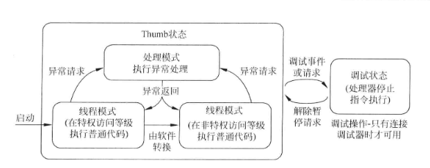

M3/M4有两种状态：

* 调试状态：处理器会停止指令的执行；

* Thumb状态：可以执行指令；

M3/M4有两种模式：

* 处理模式：这种模式下往往处理异常，具备一定的特权访问

* 线程模式：一般来说，是正常执行普通代码的模式。拥不拥有特权等级都可以；

处理器在启动后，默认进入Thumb状态下的线程模式，具备一定的特权访问的权限，不过执行的是普通代码，对于很多简单的应用，非特权的线程模式不需要用到。如下图所示：

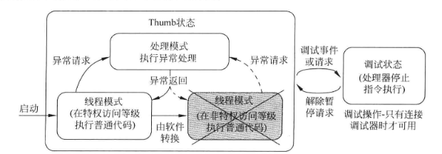


## 2.通用寄存器

cortexM3和M4处理器的寄存器中有16个寄存器，其中13个为32位的通用寄存器，其他三个用作特殊作用；


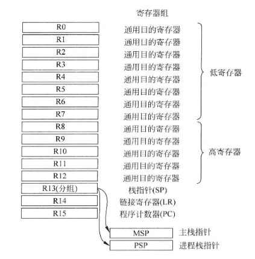

常用的名称如下：

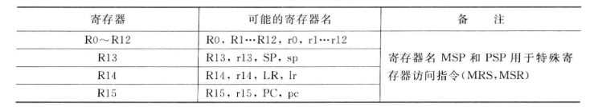

**（1）.R0~R12**

这十三个寄存器为通用寄存器，前八个（R0-R7）被称为低寄存器。(R8-R12)称为高寄存器。

**（2）.R13**

栈指针常被用POP/PUSH去操作；有两个栈指针，一个为主栈指针（MSP）,一个是进程栈指针（PSP），由特殊寄存器的CONTROL决定。常在保存上下文的时候使用。

**（3）.R14**

链接寄存器，用于函数以及子程序调用时返回地址的保存。

**（4）.R15**

程序计数器，可读可写，读返回当前指令加4，写PC会导致跳转操作。


## 3.特殊寄存器

除了寄存器组中的寄存器之外，还有一些特殊的寄存器。常用于定义处理器状态，中断/异常屏蔽。

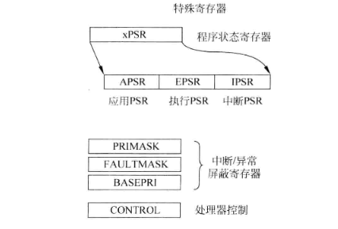

可以使用MSR和MRS等特殊寄存器访问指令来进行访问：

```c
MRS <reg> ,<special reg> ;将特殊寄存器读入寄存器
MSR <special reg>, <reg> ;写入特殊寄存器
```

区别特殊寄存器与其他例如IIC控制器里面的特殊功能寄存器。

### 3.1 程序状态寄存器

* 应用PSR(APSR) 
* 执行PSR(EPSR)

> 软件代码无法直接使用MRS/MSR直接访问

* 中断PSR(IPSR)

> 只读

这三个通过一个组合寄存器访问，如下图所示：

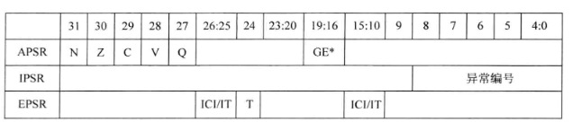

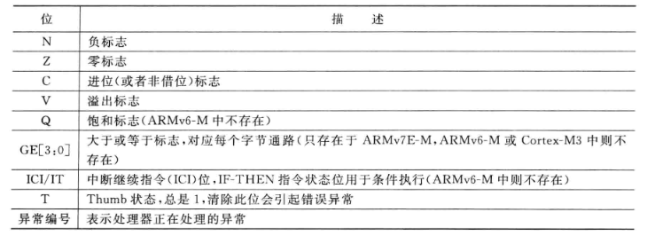

各种ARM架构之间的PSR是有略微的差别的，如下图所示展现出了不同架构的区别：

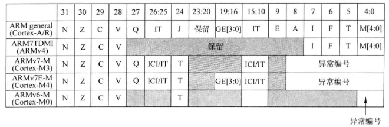

**使用方式**

```c
MRS r0 PSR ;读组合程序状态字
MSR PSR,r0 ;写组合程序状态字

单独访问：
MRS r0,APSR ;将标志状态读入R0
MRS r0,IPSR ;读取异常/中断状态
MSR APSR，r0;写标志状态
```

#### 3.1.1 应用PSR(APSR) 

> 重点提一提应用PSR(APSR) ，其他两种参考上面就可以；

* 整数状态标志

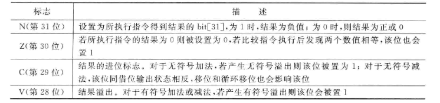

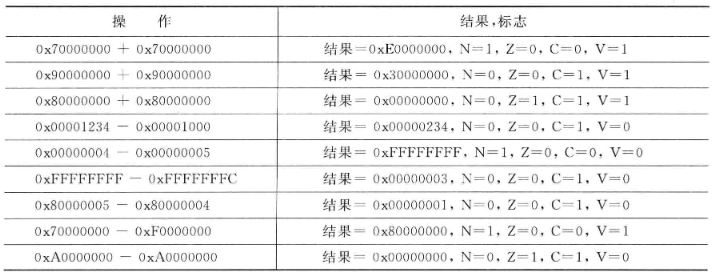

* Q状态标志

略...(用到时填补)

* GE标志

略...(用到时填补)


### 3.2 PRIMASK,FAULTMASK和BASEPRI寄存器
这三个寄存器全部用于异常与中断的屏蔽；

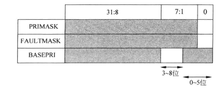

PRIMASK寄存器只有0位可以设置位的值，当设置为1使能时候，将屏蔽除不可屏蔽中断（NMI）和HardFault异常以外的所有异常；

FAULTMASK寄存器类似上面并且还能屏蔽HardFault异常；

BASEPRI可以允许用户设置更丰富的中断等级，以屏蔽相应的中断；

**使用方式**

```c
提供C语言接口：
x = _get_BASEPRI();//读BASEPRI寄存器
x = _get_PRIMASK();//读PRIMASK寄存器
x = _get_FAULTMASK();//读FAULTMASK寄存器

_set_BASEPRI(x);//设置BASEPRI寄存器
_set_PRIMASK(x);//设置PRIMASK寄存器
_set_FAULTMASK(x);//设置FAULTMASK寄存器

_disable_irq();//设置PRIMASK寄存器,禁止IRQ
_enable_irq();//设置PRIMASK寄存器,使能IRQ

汇编：
MRS r0,BASEPRI; //后面不再解释，读
MSR r0,PRIMASK;
MSR r0,FAULTMASK;

MSR BASEPRI,r0;//后面不在解释，写
MSR PRIMASK,r0;
MSR FAULTMASK,r0;
    
CPS:修改处理器状态指令    
CPSIE i;使能中断（清除PRIMASR）
CPSID i;禁止中断（设置PRIMASR）
CPSIE f;使能中断（清除FAULTMASK）
CPSID f;禁止中断（设置FAULTMASK）

```
### 3.3 CONTROL寄存器
作用

* 选择栈指针（主栈指针/进程栈指针）
* 线程模式的访问等级（特权/非特权）

下图是不同架构的CONTROL寄存器：

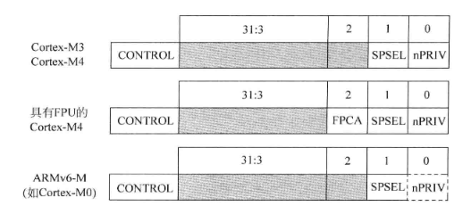

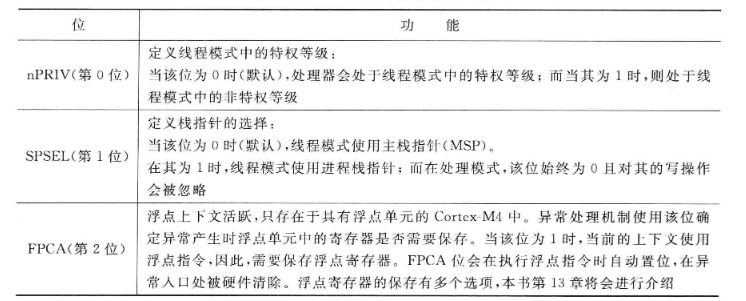

当复位以后，寄存器的数值默认为0，也就代表着处理器处于线程模式，具备特权，使用主栈指针；

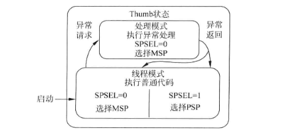

运行在非特权模式下是无法自己切回特权模式下的，想要切回去必须使用异常机制，这就提供了一个基本的安全模型；如下面两图：


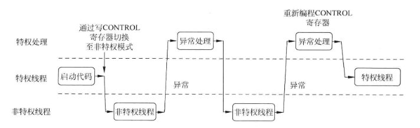


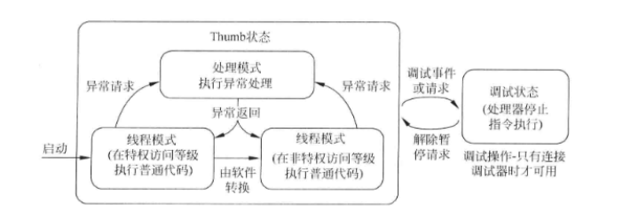

**使用方式**

四种组合

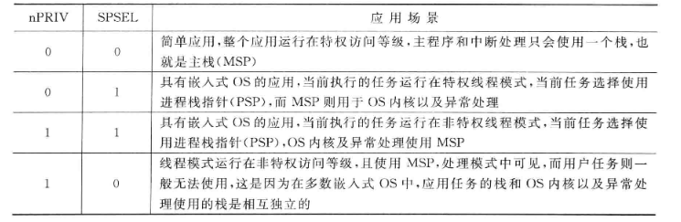

在没有使用OS的简单应用中，一般不修改CONTROL，让CPU一直在下面模式下运行就行。

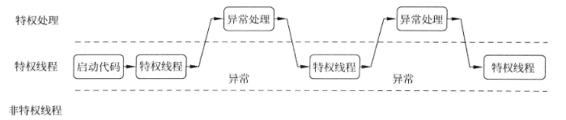

```c
c语言接口：
x = _get_CONTROL();//读取寄存器当前值
_set_CONTROL(x);//设置寄存器的数值

汇编：
MRS r0,control;
MSR CONTROL,r0;
```


### 3.4 浮点寄存器

* 该寄存器M3架构没有,M4架构存在，这里暂时不讲；
